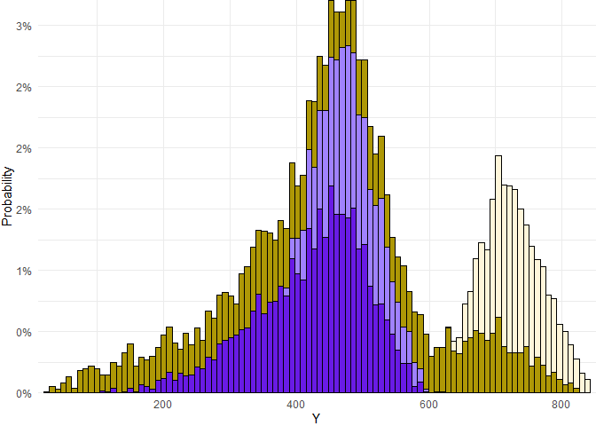

<!-- README.md is generated from README.Rmd. Please edit that file -->

**Warning**

This library is under active development and things can change at
anytime! Suggestions and help are greatly appreciated.

# SimDec


**Simulation decomposition** or **SimDec** is an uncertainty and
sensitivity analysis method, which is based on Monte Carlo simulation.
SimDec consists of three major parts:

1.  computing sensitivity indices,
2.  creating multi-variable scenarios and mapping the output values to
    them, and
3.  visualizing the scenarios on the output distribution by color-coding
    its segments.

**SimDec** reveals the nature of causalities and interaction effects in
the model. Lets have a look at how it works in R!

### Installation

``` r
devtools::install_github("Simulation-Decomposition/simdec-R")
```

### Loading Data

First the simulated ‘inputs’ and the ‘output’ need to be specified. They
can result from a Monte Carlo simulation arranged directly in R, or
conducted elsewhere and then loaded through a file, like in this
example. Lets use the the first example data that comes with the R
package.

``` r
library(SimDec)
data(example_data)                                              
output <- example_data[,1]                                      
inputs <- example_data[,2:5]                                    
```

### Compute Sensitivity Indices

Function `sensitivity_indices` computes first-order effects `FOE` (main
individual effect of every input variable), second-order effects `SOE`
(interaction effects between pairs of variables and combined sensitivity
indices `SI`.

``` r
sen    <- sensitivity_indices(output, inputs)     
SI     <- sen$SI                                  
print(SI)                                         
```

    [1] 0.04086515 0.51550451 0.09554875 0.35061248

``` r
print(sen$FOE)                                    
```

    [1] 0.0366771 0.4910688 0.1068750 0.2777653

``` r
print(sen$SOE)                                    
```

         [,1]        [,2]         [,3]        [,4]
    [1,]    0 0.003428407  0.001484804 0.003462889
    [2,]    0 0.000000000 -0.060462825 0.105905875
    [3,]    0 0.000000000  0.000000000 0.036325580
    [4,]    0 0.000000000  0.000000000 0.000000000

Each value shows what portion of the variance of the output is explained
(negative SOE values indicate correlation). In this example, SI shows
that the most significant inputs are X2 (52%) and X4 (35%). SOE points
out that there is interaction between X2 and X3 (11%) and correlation
between X2 and X3 (-6%).

### Visualize

The function ‘simdec_visualization’

1.  Chooses the most important input variables
2.  Breaks them down into states
3.  Forms scenarios out of all combinations of those states
4.  Maps the scenarios onto the output values
5.  Visualizes these scenarios by color-coding the distribution of the
    output.

#### Default Visualization (One-Output Stacked Histogram)

``` r
auto_vis    <- simdec_visualization(output, inputs, SI)
print(auto_vis$simdec_plot)
```


``` r
#auto_vis$legend_table                                 # un-comment and run
```

<p align="center">

</p>

That’s it, your ‘SimDec’ analysis is completed!

But you can customize it further.

And feel free to go an extra step in your reporting, - name the states
(i.e., low, medium, high) and merge the cells of the legend with the
same state. The help to make those automatic in would be greatly
appreciated!

#### Custom Visualization (One-Output Stacked Histogram)

The ‘simdec_visualization’ function has numerous optional arguments that
can be used to polish the outlook of the results, tune and play with the
decomposition set-up.

Here is how you can create a custom decomposition

``` r
order_of_variables_m   <- c(0, 2, 1, 0)                                                   # Specifying the order of variables for decomposition,
                                                                                          # use 0 to exclude. In this example, we set that the
                                                                                          # third input variable to be used first, and then
                                                                                          # the second variable.

number_of_states_m     <- c(0, 3, 2, 0)                                                   # Specifying the number of states for each variable. The
                                                                                          # position corresponds to the original order of inputs.

state_boundaries_m     <- matrix(c(NA, min(inputs[,2]), min(inputs[,3]),                  # Specifying numeric thresholds for every state
                                   NA, NA, 100, 657.5, NA,  
                                   NA, 650, max(inputs[,3]),
                                   NA, NA, max(inputs[,2]), NA, NA),
                                 nrow = max(number_of_states_m)+1,
                                 ncol = length(order_of_variables_m),
                                 byrow = TRUE)  

main_colors_m          <- c('#8c5eff', '#ffe252', '#0dd189')                              # Specifying the main colors to be used

custom_vis             <- simdec_visualization(output, inputs, SI,                        # Storing the results in an object called "custom_vis"
                                               order_of_variables = order_of_variables_m,
                                               number_of_states   = number_of_states_m,
                                               state_boundaries   = state_boundaries_m,
                                               main_colors        = main_colors_m)
print(custom_vis$simdec_plot)                                                             # Viewing the plot
```



``` r
#custom_vis$legend_table                                                                  # un-comment and run
```

<p align="center">

</p>

#### Boxplot

Adding option plot_type = “Boxplot” in the ‘simdec_visualization’
function displays the results in the form of boxplot instead of stacked
histogram.

``` r
vis_boxplot <- simdec_visualization(output, inputs, SI, plot_type = "Boxplot")
print(vis_boxplot$box_plot)
```


``` r
# vis_boxplot$legend_table                           # un-comment and run
```

<p align="center">

</p>

The boxplot visualization presents exactly the same decomposition and
contains the same scenarios, color-coded in the same way as in the
stacked histogram.

A boxplot is handy when some scenarios have little data and are poorly
visible on the histogram.

#### Two-Output Scatterhist

If relationship between two output variables is in question, the
‘simdec_visualization’ function can build a scatter plot with two
corresponding histograms on the top and right side, all decomposed and
colored by the logic created for the main output variable.

To create the scatterhist one needs to specify the second output
variable for the argument ‘otput_2’, additional optional arguments
include ‘Scatter_Fraction’, which defines how many dots are shown on the
scatter plot (1 - all, 0.5 - every second). For other optional arguments
run ‘?simdec_visualization’.

``` r
data("example_data_2")
output_1        <- example_data_2[, 1]
output_2        <- example_data_2[, 2]
inputs          <- example_data_2[, 3:10]
sen    <- sensitivity_indices(output, inputs)     
SI     <- sen$SI

# un-comment and run 

# vis_scatterhist <- simdec_visualization(output_1, inputs, SI, output_2, Scatter_Fraction = 0.005)
# vis_scatterhist$scatter_hist
# vis_scatterhist$legend_table
```

<p align="center">

</p>
<p align="center">

</p>

We can change x- and y-axes limits for both histograms, the scatter plot
scales accordingly.

``` r
# custom_scatterhist <- simdec_visualization(output   = output_1,
#                                            inputs   = inputs,
#                                            SI       = SI,
#                                            output_2 = output_2,
#                                            XLim     = c(1000, 3000),
#                                            YLim     = c(0, 4), 
#                                            Scatter_Fraction = 0.005)
# custom_scatterhist$scatter_hist            # un-comment and run 
```

<p align="center">

</p>

(The graph demonstrates that not only Output1 axis has been changed as
specified in the code above (scatter plot x-axis), but the second
histogram has been automatically truncated as well (x-axis of the
rotated right histogram and the corresponding y-axis of the scatter
plot) to avoid empty space in the scatter plot.)

If the full control over the both axes of the scatterplot is needed,
both ‘XLim’ and ‘XLim2’ should be specified.

``` r
# un-comment and run

# custom_scatterhist_2 <- simdec_visualization(output   = output_1,
#                                              inputs   = inputs,
#                                              SI       = SI,
#                                              output_2 = output_2,
#                                              XLim     = c(1000, 3000),
#                                              XLim2     = c(0, 1000),
#                                              Scatter_Fraction = 0.005)
# custom_scatterhist_2$scatter_hist
```

<p align="center">

</p>

### Links

- See how to read SimDec on wikipedia:
  <https://en.wikipedia.org/wiki/Simulation_decomposition>
- Meet people behind SimDec: <https://www.simdec.fi/team>
- Stay in touch via our Sensitivity Analysis discord community:
  <https://discord.com/invite/54SFcNsZS4>

### Citations

The algorithms and visualizations used in this package came primarily
out of research at LUT University, Lappeenranta, Finland, and Stanford
University, California, U.S., supported with grants from Business
Finland, Wihuri Foundation, Foundation for Economic Education, and
Natural Sciences and Engineering Research Council. If you use SimDec in
your research we would appreciate a citation to the following
publications:

- Kozlova, M., Moss, R. J., Yeomans, J. S., & Caers, J. (2024).
  Uncovering Heterogeneous Effects in Computational Models for
  Sustainable Decision-making. Environmental Modelling & Software,
  171, 105898. <https://doi.org/10.1016/j.envsoft.2023.105898>

- Kozlova, M., Moss, R. J., Roy, P., Alam, A., & Yeomans, J. S. (2024).
  SimDec algorithm and guidelines for its usage and interpretation.
  In M. Kozlova & J. S. Yeomans (Eds.), Sensitivity Analysis for
  Business, Technology, and Policymaking. Made Easy with Simulation
  Decomposition. Routledge. [Available here](https://github.com/Simulation-Decomposition/SimDec-book/blob/74ce72c1d3dda650eba1c59e3b215a4bb35c6be0/chapters/02_SimDec_algorithm_and_instructions/Ch2.pdf).
